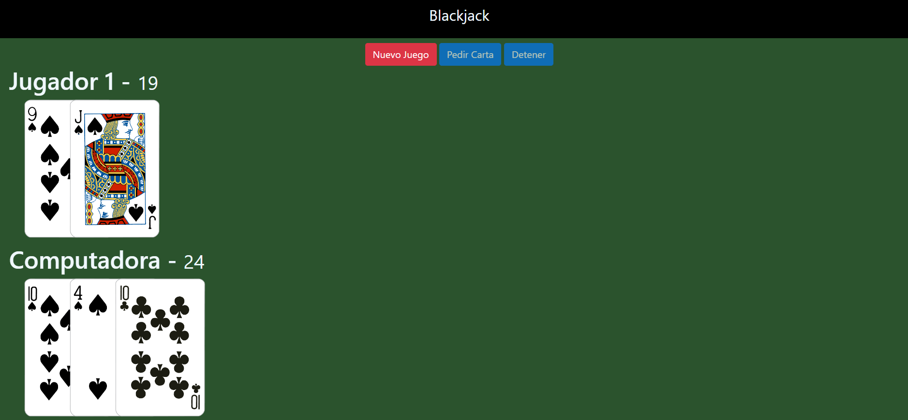

# Blackjack.js

Bienvenido al repositorio de la implementación de un juego de Blackjack en el navegador, donde podrás desafiar a la máquina y poner a prueba tu suerte y estrategia en este clásico juego de cartas.

## Descripción

Este proyecto es una implementación sencilla del juego de Blackjack (también conocido como 21) utilizando HTML, CSS y JavaScript. El juego te permite jugar contra la máquina y tratar de vencerla obteniendo una mano con un valor cercano a 21 sin pasarte.
